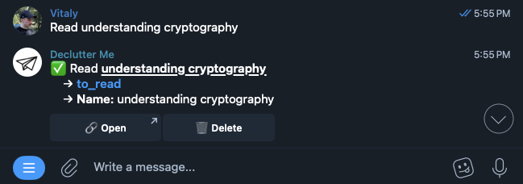

# Declutter Me

## Description

Keep your notes organized by automatically parsing and putting them into corresponding database.

Features:
- 🔍️️️️️️ Automatically detect which database to use for each note
- 📝️️️️️️ Extract properties with proper types from your notes
- 💡️️️️️️ A powerful and simple syntax for your message templates

Supported integrations:
- Telegram – for quickly sending your notes
- Notion – to store them in corresponding database

## Stack & tools
- Node.JS
- Telegraf, Express, Mocha
- React, Material UI
- PostgreSQL
- Telegram Bot API, Notion API

## Project structure
- `backend/` – a Telegram Bot that saves notes to Notion
- `frontend/` – a template builder built with React
- `templater/` – an NPM package for parsing and applying message templates 

## Commands
- `npm start` – run the project
- `npm test` – run unit tests
- `npm db:migrate` – run database migrations
- `npm run deploy` – deploy to Github Pages
